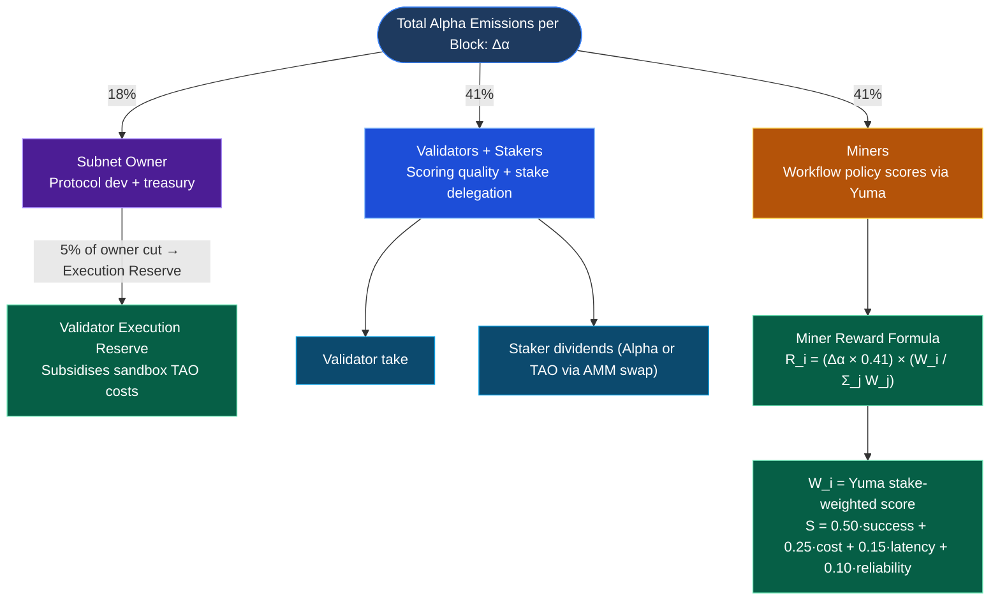
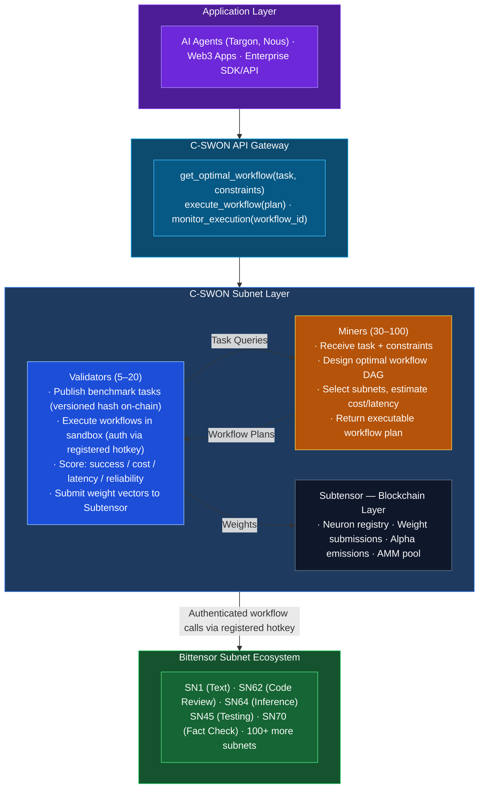
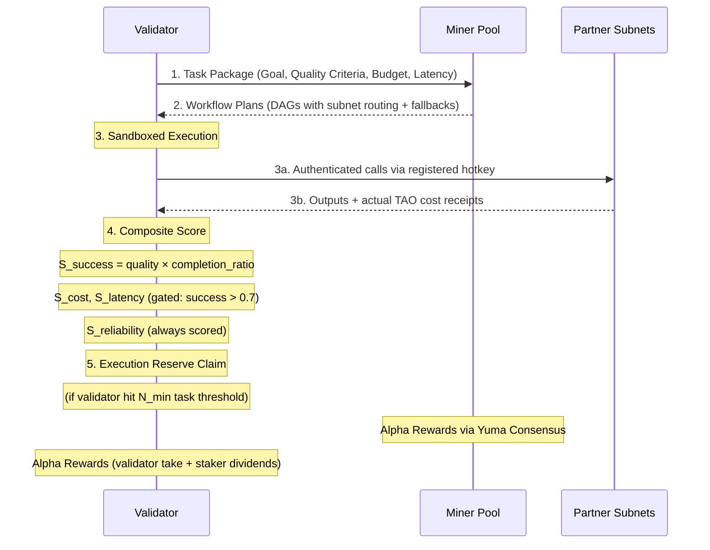

# C-SWON: Cross-Subnet Workflow Orchestration Network

**Bittensor Subnet Proposal**
*"Zapier for Subnets" - The Intelligence Layer for Multi-Subnet Composition*

> **GitHub:** https://github.com/adysingh5711/C-SWON · **Whitepaper:** Upcoming

---

## 1. Introduction: The Vision for a Composable AI Operating System

Bittensor hosts over 100 specialized subnets, covering text generation, code review, inference, agents, data processing, and fact-checking, yet there is no native way to compose them into reliable, end-to-end workflows. Developers today manually wire calls to 5–10 subnets per application, guess at optimal routing, and rebuild orchestration logic from scratch every time. This is the core bottleneck preventing Bittensor from evolving from a collection of isolated AI services into a true composable AI operating system.

**C-SWON (Cross-Subnet Workflow Orchestration Network)** directly addresses this gap. It is a Bittensor subnet where **the mined commodity is optimal workflow policy**-miners propose multi-subnet execution plans (DAGs), validators score them on task success, cost, and latency, and the network continuously learns the best orchestration strategies through competitive pressure.

The result is an intelligent routing layer that turns any complex AI task into a single, optimized workflow. Just as Zapier abstracted away manual automation for Web2, C-SWON abstracts away manual orchestration for Bittensor's AI ecosystem, making optimal multi-subnet composition first-class intelligence on the network.

---

## 2. Incentive & Mechanism Design

The incentive mechanism of C-SWON is engineered to reward genuine orchestration intelligence - not raw output quality, but the quality of the *coordination strategy* used to produce it.

### 2.1 Emission Structure (dTAO Standard)

C-SWON operates under Bittensor's Dynamic TAO (dTAO) model. All participant rewards are paid in **CSWON Alpha tokens**, not TAO directly. TAO is injected into the subnet's AMM liquidity pool each block, and Alpha is distributed to participants via Yuma Consensus each epoch (~360 blocks / ~72 minutes).

**Alpha emission split per block:**



| Variable | Unit         | Definition |
|----------|--------------|------------|
| Δα       | Alpha/block  | Total Alpha allocated to participants per block |
| R_i      | Alpha        | Reward to miner i per epoch |
| W_i      | float [0,1]  | Yuma stake-weighted composite score for miner i |
| W_j      | float [0,1]  | Score for miner j — normalisation denominator |

**Note on TAO liquidity:** TAO is injected into the C-SWON AMM pool at each block proportionally to Alpha injection to keep the Alpha price stable. Stakers who hold TAO on the root subnet receive a portion of validator dividends converted to TAO via this AMM swap. This means the subnet's AMM pool deepens with usage, creating organic liquidity without requiring external market-making.

**Note on halving:** Alpha participant rewards (miners, validators, owner) are subject to an Alpha halving when total CSWON Alpha issuance hits a predetermined supply threshold. TAO pool injections halve at Bittensor-wide TAO halving events but Alpha participant rewards remain constant during TAO halvings.

### 2.2 Validator Execution Reserve

Validators execute miner-submitted workflows in a sandboxed environment, which involves making real calls to partner subnets (SN1, SN62, SN45, etc.) that cost TAO. To ensure validator solvency is not a participation barrier:

- **5% of the owner's 18% cut** is held in a protocol-controlled Validator Execution Reserve each epoch.
- Validators who complete ≥ N_min benchmark tasks per epoch (threshold published in `validator/config.py`) claim a pro-rata subsidy from this reserve.
- **Testnet / early mainnet:** Validators use mock execution against a local subnet simulator — no real TAO is burned. Mock mode is toggled via `CSWON_MOCK_EXEC=true`.
- **Long-term:** Phase 3 workflow fees (see Section 5) replace the reserve as the primary validator cost offset.

### 2.3 Scoring Formula

Every workflow a miner submits is executed in a sandboxed environment by validators. A composite score **S ∈ [0, 1]** is computed across four dimensions:

```
S = 0.50 × S_success + 0.25 × S_cost + 0.15 × S_latency + 0.10 × S_reliability
```

**Sub-dimension formulas (explicit):**

```
S_success   = output_quality_score × completion_ratio
              where completion_ratio = steps_completed / total_steps_in_dag

S_cost      = max(0, 1 - actual_tao / max_budget_tao)
              only scored when S_success > 0.7; else S_cost = 0

S_latency   = max(0, 1 - actual_seconds / max_latency_seconds)
              only scored when S_success > 0.7; else S_latency = 0

S_reliability = max(0, 1 - (retries × 0.10 + timeouts × 0.20 + hard_failures × 0.50))
              applied regardless of success gate
```

**Partial DAG completion:** If a 4-step workflow completes 3 steps before a hard failure, `completion_ratio = 0.75`. This prevents miners from designing workflows that always succeed on step 1 but silently skip subsequent steps.

**Success-first gating** on cost and latency enforces correct priority ordering: a workflow that fails the task cannot be considered "good" regardless of how cheap or fast it is. Reliability is always scored because error handling quality is independent of whether the task ultimately succeeds.

Scores are aggregated over a rolling 100-task window per miner using exponential decay (λ = 0.95 per task, recent performance weighted more heavily), normalised, and capped at 15% per miner before weight submission.

### 2.4 Incentive Alignment

**For Miners:** The scoring formula creates four simultaneous optimisation pressures: maximise task success rate, minimise TAO expenditure on successful workflows, reduce end-to-end latency, and build robust error handling. Miners that invest in profiling subnets, building reusable workflow templates, and adapting to benchmark evolution will consistently outperform static or hardcoded approaches.

**For Validators:** Alpha emissions and stake delegation are tied directly to the quality of their benchmarks and scoring. Validators maintaining richer, more diverse benchmark suites produce better-calibrated miners, and higher-quality miners increase subnet Alpha demand — which in turn raises all validators' token value. This creates a natural incentive to invest in evaluation infrastructure.

**For Stakers:** Staking CSWON Alpha gives proportionally higher validator weight than TAO root-staking (100% vs 18% weight multiplier). As Alpha supply grows relative to TAO, stakers who hold CSWON Alpha capture a larger share of emissions, incentivising long-term liquidity provision in the subnet pool.

### 2.5 Anti-Gaming Mechanisms

- **Synthetic Ground Truth Tasks (15–20%):** Validators inject tasks with known optimal workflows. Miners cannot distinguish these from real tasks.
- **Multi-Validator Consensus:** The same task is sent to multiple validators. Systematic scoring divergence flags both dishonest miners and faulty validators.
- **Dynamic Benchmark Rotation:** Validators regularly introduce new task categories. Older tasks are deprecated once widespread solutions emerge.
- **Execution Sandboxing:** Validators execute all workflows in isolated environments, monitoring actual subnet calls and real TAO flows.
- **Temporal Consistency Checks:** Sudden unexplained performance jumps are flagged for review.
- **Completion Ratio Enforcement:** The `completion_ratio` formula prevents DAG shortcutting — submitting a single-step workflow for a multi-step task always results in a proportionally penalised score.

---

## 3. Miner Design

The role of the miner in C-SWON is to act as a workflow architect: given a task description and resource constraints, produce an optimal multi-subnet execution plan that reliably accomplishes the goal.

### 3.1 Registration Requirements

| Requirement | Minimum | Recommended |
|-------------|---------|-------------|
| TAO stake   | 1 TAO   | 10 TAO      |
| CPU         | 4 cores | 8 cores     |
| RAM         | 16 GB   | 32 GB       |
| Network     | 100 Mbps| 1 Gbps      |
| Uptime SLA  | 90%     | 99%         |

Miners below 1 TAO stake cannot register. Miners falling below 90% uptime over a rolling 500-block window are deweighted proportionally in Yuma scoring.

### 3.2 Miner Tasks

The miner's core task is **workflow policy design**. Given a structured task package from a validator, the miner returns an executable DAG.

**Input (Task Package from Validator):**

```json
{
  "task_id": "uuid-v4",
  "task_type": "code_generation_pipeline",
  "description": "Generate a Python FastAPI endpoint for user authentication with JWT tokens, including unit tests",
  "quality_criteria": {
    "functional_correctness": true,
    "test_coverage": ">80%",
    "code_style": "PEP8"
  },
  "constraints": {
    "max_budget_tao": 0.05,
    "max_latency_seconds": 10.0,
    "allowed_subnets": ["SN1", "SN62", "SN64", "SN45", "SN70"]
  },
  "available_tools": {
    "SN1":  { "type": "text_generation", "avg_cost": 0.001,  "avg_latency": 0.5 },
    "SN62": { "type": "code_review",     "avg_cost": 0.003,  "avg_latency": 1.2 },
    "SN64": { "type": "inference",       "avg_cost": 0.0005, "avg_latency": 0.3 },
    "SN45": { "type": "code_testing",    "avg_cost": 0.002,  "avg_latency": 2.0 },
    "SN70": { "type": "fact_checking",   "avg_cost": 0.0015, "avg_latency": 0.8 }
  }
}
```

**Output (Workflow Plan from Miner):**

```json
{
  "task_id": "uuid-v4",
  "miner_uid": 42,
  "workflow_plan": {
    "nodes": [
      {
        "id": "step_1", "subnet": "SN1", "action": "generate_code",
        "params": { "prompt": "Generate FastAPI endpoint with JWT auth...", "max_tokens": 2000 },
        "estimated_cost": 0.0012, "estimated_latency": 0.6
      },
      {
        "id": "step_2", "subnet": "SN62", "action": "review_code",
        "params": { "code_input": "${step_1.output}", "review_criteria": ["security", "style"] },
        "estimated_cost": 0.0035, "estimated_latency": 1.5
      },
      {
        "id": "step_3", "subnet": "SN45", "action": "generate_tests",
        "params": { "code_input": "${step_2.output.revised_code}", "coverage_target": 0.85 },
        "estimated_cost": 0.0025, "estimated_latency": 2.2
      }
    ],
    "edges": [
      { "from": "step_1", "to": "step_2" },
      { "from": "step_2", "to": "step_3" }
    ],
    "error_handling": {
      "step_1": { "retry_count": 2, "fallback_subnet": "SN64" },
      "step_2": { "retry_count": 1, "timeout_seconds": 3.0 }
    }
  },
  "total_estimated_cost": 0.0072,
  "total_estimated_latency": 4.3,
  "confidence": 0.88,
  "reasoning": "Sequential pipeline: generate → review → test."
}
```

### 3.3 Performance Dimensions

| Dimension           | Weight | Formula |
|---------------------|--------|---------|
| Task Success        | 50%    | `output_quality × completion_ratio` |
| Cost Efficiency     | 25%    | `max(0, 1 - actual/budget)` gated at S_success > 0.7 |
| Latency             | 15%    | `max(0, 1 - actual_s/max_s)` gated at S_success > 0.7 |
| Reliability         | 10%    | `max(0, 1 - retries×0.1 - timeouts×0.2 - failures×0.5)` |

Three additional dimensions are tracked but not yet weighted in emissions:
- **Creativity:** Novel subnet combinations not in baseline workflows
- **Robustness:** Score consistency across semantically similar tasks
- **Explainability:** Quality of the `reasoning` field

### 3.4 Miner Development Lifecycle

1. **Profile Subnets:** Gather historical cost, latency, and reliability data for available subnets. Refresh every 100 blocks via the metagraph.
2. **Build Workflow Templates:** Develop reusable DAG patterns for common task categories (code pipelines, RAG queries, agent tasks, data transforms).
3. **Optimise for Constraints:** Implement cost and latency passes — substitute cheaper subnets when over budget, parallelise independent steps when over latency target.
4. **Deploy and Monitor:** Serve the workflow planner via a Bittensor axon. Track scores on the public dashboard and iterate based on benchmark performance.

---

## 4. Validator Design

Validators define challenging tasks, execute submitted workflow plans in a sandboxed environment, measure real outcomes, and translate those measurements into honest
on-chain weights.

### 4.1 Subnet Call Authentication

When a validator executes a miner's workflow, each DAG step calls a partner subnet (e.g., SN1, SN62). Authentication works as follows:

| Stage     | Authentication Model |
|-----------|---------------------|
| Testnet   | Mock execution against local subnet simulator (`CSWON_MOCK_EXEC=true`). No real calls, no TAO burned. |
| Mainnet bootstrap | C-SWON registers a designated validator hotkey on each partner subnet. Calls are made at the partner subnet's standard rates, subsidised by the Validator Execution Reserve. |
| Mainnet at scale  | Negotiated API-tier access with high-traffic partner subnets (SN1, SN64). Revenue-share agreements (5% of C-SWON workflow fees routed to partner subnet) replace per-call costs. |

All subnet calls made during sandboxed execution are logged with actual TAO consumed. Validators cannot fake execution results — every call produces a verifiable on-chain
receipt from the target subnet.

### 4.2 Benchmark Governance

Benchmark tasks are stored **off-chain** in a versioned JSON dataset hosted in the C-SWON GitHub repository (`benchmarks/v{N}.json`). At each epoch, validators commit an on-chain hash of the benchmark version they are using. This provides:

- **Auditability:** Anyone can verify which benchmark version a validator used
- **Controlled updates:** New benchmark versions are merged via PR with ≥3 validator sign-offs before the on-chain hash is updated
- **Tamper detection:** A validator submitting weights based on an unrecognised benchmark hash is flagged by peer consensus

Benchmark composition per version: 15–20% synthetic ground truth tasks, 80–85% diverse real-world tasks across code pipelines, RAG, agent tasks, and data transforms.
Minimum 50 tasks per version. Tasks are deprecated when >70% of miners consistently score above 0.90, triggering mandatory rotation.

### 4.3 Scoring and Evaluation Methodology

The evaluation process follows a structured six-stage pipeline for each task cycle:

1. **Benchmark Task Selection:** Load a task from the versioned benchmark suite. Commit the benchmark hash on-chain for auditability.
2. **Miner Workflow Collection:** Send the task to 5–10 randomly selected miners. Collect workflow plans with a 30-second timeout. Filter out malformed or constraint-violating plans.
3. **Sandboxed Execution:** For each valid workflow, initialise an isolated execution environment. Execute each step, tracking actual TAO consumed, wall-clock latency, retry counts, timeout events, and `steps_completed` for the completion ratio.
4. **Output Quality Evaluation:** Score the final output against quality criteria:
   - *Code tasks:* Automated tests, style compliance, functional correctness.
   - *RAG tasks:* Answer relevance, citation quality, factual accuracy.
   - *Agent tasks:* Goal completion, reasoning coherence.
5. **Composite Scoring:** Apply the four-dimensional formula. Compute `S_success = output_quality × completion_ratio`. Apply exponential decay (λ = 0.95) over the rolling 100-task window.
6. **Weight Submission:** Every ~500 blocks, aggregate scores, cap any single miner at 15% of total weight, and submit to Subtensor.

### 4.4 Evaluation Cadence

- **Query frequency:** ~every 12 seconds (Bittensor block time)
- **Score updates:** Rolling 100-task window with λ = 0.95 exponential decay
- **Weight submission:** Every ~500 blocks (~100 minutes)
- **Benchmark version updates:** Community PR process, ≥3 validator sign-offs

### 4.5 Validator Incentive Alignment

- **Stake at Risk:** Validators must stake CSWON Alpha to participate. Poor performance leads to delegation loss. Detected manipulation risks slashing.
- **Cross-Validator Consensus:** Validators compare scores on overlapping tasks. Divergence >2 standard deviations from consensus damages reputation.
- **Benchmark Quality Feedback Loop:** Richer benchmarks → better miners → higher Alpha demand → higher validator returns.
- **Execution Reserve Access:** Only validators meeting the N_min task threshold per epoch receive execution subsidies, penalising lazy or inactive validators.

---

## 5. Alpha Token Economy

### 5.1 CSWON Alpha Role

CSWON Alpha is the primary economic unit within the subnet:

| Actor     | Earns          | Stakes           | Can Swap to TAO via AMM? |
|-----------|----------------|------------------|--------------------------|
| Miners    | Alpha (41% cut)| — (not required) | Yes |
| Validators| Alpha (41% cut)| Alpha (as bond)  | Yes |
| Stakers   | Alpha dividends| Alpha or TAO     | Yes (auto for TAO stakers) |
| Owner     | Alpha (18% cut)| —                | Yes |

### 5.2 Liquidity Maintenance

The dTAO AMM pool maintains TAO/CSWON Alpha liquidity automatically:

1. Each block, TAO is injected into the pool proportionally to Alpha injection, keeping the Alpha price stable.
2. Validators whose delegators hold root TAO receive a portion of their Alpha dividends auto-converted to TAO via the pool.
3. Phase 3 workflow fees (70% miners / 20% validators / 10% treasury, paid in Alpha) increase buy pressure on Alpha — strengthening the pool's depth over time.
4. The subnet's emission rate (and thus pool growth) is governed by **net TAO inflows** under the flow-based Taoflow model. Subnets with net outflows receive zero emissions, so attracting genuine stakers is a first-class priority.

### 5.3 Phase 3 Fee Flow (Month 12+)

```
Workflow fee = 5% surcharge on total TAO spent in a workflow

Distribution:
  Miners:     70% of fee
  Validators: 20% of fee
  Treasury:   10% of fee (dev fund, grants, marketing)

Illustrative (Month 12):
  100K workflows/day × 30 days × 0.0015τ fee × $500/TAO = $2.25M/month
    Miners:    $1.58M
    Validators: $450K
    Treasury:   $225K
```

---

## 6. System Architecture

### 6.1 High-Level Architecture



### 6.2 Validation Cycle Detail



### 6.3 Risk Register

| Risk | Impact | Mitigation |
|------|--------|------------|
| Low miner participation | Network fails to bootstrap | Early emission multipliers, GPU credits, $50K grants |
| Validator centralization | Collusion risk | Stake matching for first 10 validators, cross-validator consensus audits |
| Benchmark staleness | Miners overfit | Dynamic rotation, community PRs, quarterly forced refresh |
| Competing orchestration layer | Market fragmentation | First-mover advantage, deep API integration, network effects |
| Insufficient subnet diversity | Limited workflow variety | Revenue-share agreements with partner subnets |
| High execution costs | Developers avoid C-SWON | Cost scoring baked in; early usage subsidised |
| **Validator TAO solvency** | **Validators exit due to negative unit economics from sandbox calls** | **Validator Execution Reserve (5% of owner cut); mock execution on testnet; long-term offset via Phase 3 fees** |
| Negative net TAO inflows | Zero emissions under Taoflow model | Active staker acquisition program; public Alpha staking ROI dashboard |
| Alpha halving impact | Sudden reward reduction | Pre-announced milestone tracking; treasury buffer for bridging halving transitions |

---

## 7. Business Logic & Market Rationale

### The Problem and Why It Matters

Bittensor has become a rich ecosystem of 100+ specialized subnets, but no native layer exists to compose them into reliable, optimized workflows. Today, developers face a set of compounding problems:

- **Manual orchestration:** Every team hand-wires calls to 5–10 subnets per application, rebuilding logic from scratch.
- **No objective benchmarks:** There is no standard for measuring which subnet combinations work best for a given task.
- **Brittle integrations:** No standardized error handling, retry logic, or failover across subnet boundaries.
- **Wasted TAO:** Suboptimal routing burns budget on expensive or slow execution paths.
- **Innovation bottleneck:** Engineering effort is consumed by plumbing, not product differentiation.

These problems compound: each new subnet that joins Bittensor *increases* the orchestration surface area, making the problem worse over time without a dedicated solution layer.

**Market Signal:** In Web2, Zapier grew to $140M ARR by solving workflow orchestration. In AI, LangChain and LlamaIndex raised $100M+ building agent orchestration frameworks. The Bittensor ecosystem needs its native equivalent-one that is decentralized, incentive-aligned, and continuously improving through competition.

### Competing Solutions

**Within Bittensor:**

| Solution                                           | What It Does                              | Why C-SWON Is Different                                                                    |
| -------------------------------------------------- | ----------------------------------------- | ------------------------------------------------------------------------------------------ |
| **Manual Integration**                       | Developers call subnets directly via API  | C-SWON automates optimal routing through competition; no bespoke integration code required |
| **Bittensor API Layer** *(in development)* | Provides unified API access to subnets    | Solves interop infrastructure, not routing intelligence; C-SWON sits on top                |
| **Agent Subnets (SN6, etc.)**                | Build agents that use tools               | Agents*consume* the orchestration layer; C-SWON provides the optimal strategies they use |
| **Individual Subnet Routers**                | Some subnets have internal load balancing | C-SWON operates*across* subnets, not within a single one                                 |

**Outside Bittensor:**

| Solution                         | Strengths                      | Limitations vs. C-SWON                                                                   |
| -------------------------------- | ------------------------------ | ---------------------------------------------------------------------------------------- |
| **LangChain / LlamaIndex** | Popular, large community       | Centralized; no incentivized optimization; developers still write routing logic manually |
| **OpenAI Assistants API**  | Tight integration, easy to use | Locked to OpenAI models; no composability with external AI providers                     |
| **Zapier / Make.com**      | No-code, accessible            | Not AI-native; no ML model orchestration; no competitive optimization                    |
| **AWS Step Functions**     | Reliable state machines        | Generic infrastructure; no AI intelligence; expensive at scale; vendor lock-in           |

### Why Bittensor Is Ideal for This Use Case

C-SWON is not just a good idea in the abstract-it is specifically well-suited to the Bittensor architecture for five reasons:

1. **Native Composability:** Bittensor already treats subnets as modular services. C-SWON extends this design to *intelligent* composition rather than dumb API chaining.
2. **Incentive-Driven Optimization:** Centralized orchestrators optimize for vendor profit. C-SWON miners compete to find genuinely optimal workflows, aligned with end users, not platform margin.
3. **Verifiable Performance:** Validators execute workflows and measure real outcomes on-chain. There is no "trust the framework" black box.
4. **Network Effects:** Every new subnet makes C-SWON more valuable (more building blocks). Every C-SWON workflow makes participating subnets more valuable (more usage). The value of the orchestration layer scales super-linearly with the number of subnets.
5. **Decentralized Resilience:** If one subnet underperforms, workflows automatically adapt. Orchestration logic is distributed across miners-no single point of failure.


### Development Phases

| Phase | Timeline | Target |
|-------|----------|--------|
| 1 — Bootstrap | Months 1–6 | 30–50 miners, 5–10 validators, 1,000+ workflows/day; mock execution on testnet |
| 2 — Developer Adoption | Months 6–12 | 10+ apps, 10,000+ workflows/day; mainnet with live sandbox execution |
| 3 — Revenue Model | Months 12–24 | Per-workflow fee launch; Phase 3 fee stream replaces Execution Reserve |
| 4 — Ecosystem Standard | 24+ months | Default orchestration layer; Bittensor API gateway integration |

---

## 8. Go-To-Market Strategy

### Target Users and Anchor Use Cases

C-SWON's primary users are **agent platform builders**-teams building on Targon (SN4), Nous (SN6), or LangChain-based Bittensor integrations-who currently spend 70%+ of their engineering effort on manual orchestration plumbing.

Three anchor use cases demonstrate the value proposition concretely:

1. **Code Pipeline as a Service** - Input: "Build X feature." C-SWON workflow: `SN1 (generate) → SN62 (review) → SN45 (test)`. Result: 10x faster than manual, 30% lower cost, higher quality.
2. **RAG + Fact-Check Stack** - Input: User question. Workflow: `Document subnet (retrieve) → Text subnet (generate) → SN70 (verify)`. Result: Trustworthy AI responses for regulated industries.
3. **Multi-Model Consensus** - Input: High-stakes decision (legal, medical, financial). Workflow: `3× text subnets → SN70 (fact-check) → confidence aggregation`. Result: High-reliability outputs with transparent reasoning chains.

**Secondary users** are Bittensor subnet operators (Chutes, Ridges, Document Understanding) who benefit from increased traffic by being included in popular workflows-making them natural promoters of the C-SWON ecosystem.

### Distribution Channels

**Technical:**

- `bittensor-cswon` TypeScript/Python SDK - one-line integration: `cswon.execute("task", constraints)`
- Bittensor API Gateway partnership for "recommended orchestration" placement
- Pre-built integrations for Targon, Nous, and LangChain Bittensor connectors

**Community:**

- Developer tutorials: "Build a production AI pipeline in 10 minutes with C-SWON"
- Hackathon bounties: $50K prize pool across three events in Months 3, 6, and 9
- Research publications: benchmark studies comparing C-SWON vs. manual orchestration

**Partnerships:**

- Revenue share with subnets called via C-SWON workflows (5% of fees routed back to subnet)
- Enterprise pilot program: 5–10 companies with white-glove onboarding in the first 90 days

### Early Participation Incentives

| Stakeholder | Incentive |
|-------------|-----------|
| Miners (first 50) | 1.5× Alpha emission multiplier for first 6 months + GPU credits ($500–$1,000) + $50K grants pool |
| Validators (first 10) | 2:1 Alpha stake match (up to 1,000 TAO equivalent) + $20K benchmark dataset grants + elevated DAO governance voting |
| Developers | First 10,000 workflows free per project + $500–$2,000 migration bounty |
| Subnet Partners | 5% traffic revenue share from C-SWON fees + $10K co-marketing budget |

---

## Conclusion

> *"Bittensor has 100+ specialized AI services, but no brain to wire them together. C-SWON is that brain-a subnet where the commodity is optimal orchestration policy. We turn 'which subnets to call and how' into a competitive intelligence market, making Bittensor the world's first truly composable AI operating system. This isn't just another subnet-it's the meta-layer that makes all other subnets exponentially more valuable."*

> **GitHub:** [https://github.com/adysingh5711/C-SWON](https://github.com/adysingh5711/C-SWON) </br>
> **Demo:** [https://youtu.be/X2RZts7AXX0](https://youtu.be/X2RZts7AXX0) </br>
> **Hackathon Link:** [https://www.hackquest.io/hackathons/Bittensor-Subnet-Ideathon](https://www.hackquest.io/hackathons/Bittensor-Subnet-Ideathon) </br>
> **Results:** [https://x.com/singhaditya5711/status/2030662024922071367?s=20](https://x.com/singhaditya5711/status/2030662024922071367?s=20) </br>
> **Whitepaper:** Upcoming

*C-SWON: Cross-Subnet Workflow Orchestration Network - Making Bittensor Composable*