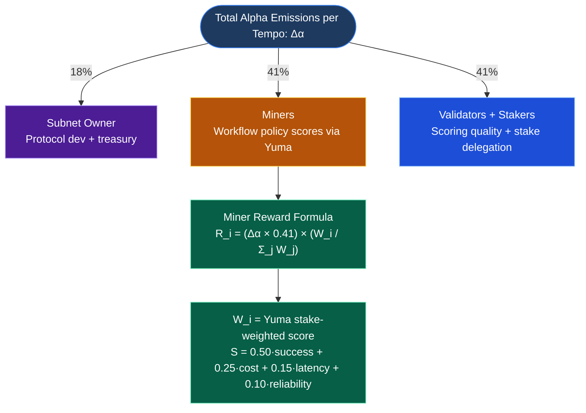
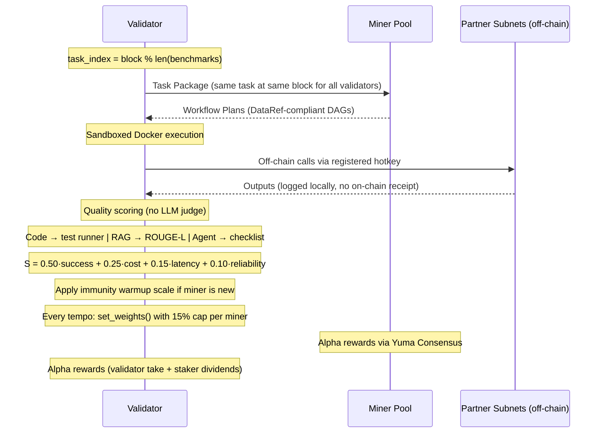

# C-SWON: Cross-Subnet Workflow Orchestration Network

**Bittensor Subnet Proposal**
*"Zapier for Subnets" - The Intelligence Layer for Multi-Subnet Composition*

> **GitHub:** https://github.com/adysingh5711/C-SWON · **Whitepaper:** Upcoming

---

## 1. Introduction: The Vision for a Composable AI Operating System

Bittensor hosts over 100 specialized subnets, covering text generation, code review, inference, agents, data processing, and fact-checking, yet there is no native way to compose them into reliable, end-to-end workflows. Developers today manually wire calls to 5–10 subnets per application, guess at optimal routing, and rebuild orchestration logic from scratch every time. This is the core bottleneck preventing Bittensor from evolving from a collection of isolated AI services into a true composable AI operating system.

**C-SWON (Cross-Subnet Workflow Orchestration Network)** directly addresses this gap. It is a Bittensor subnet where **the mined commodity is optimal workflow policy**-miners propose multi-subnet execution plans (DAGs), validators score them on task success, cost, and latency, and the network continuously learns the best orchestration strategies through competitive pressure.

The result is an intelligent routing layer that turns any complex AI task into a single, optimized workflow. Just as Zapier abstracted away manual automation for Web2, C-SWON abstracts away manual orchestration for Bittensor's AI ecosystem, making optimal multi-subnet composition first-class intelligence on the network.

---

## 2. Incentive & Mechanism Design

The incentive mechanism of C-SWON is engineered to reward genuine orchestration intelligence - not raw output quality, but the quality of the *coordination strategy* used to produce it.

### 2.1 Emission Structure (dTAO Standard)

C-SWON operates under Bittensor's Dynamic TAO (dTAO) model. All participant rewards are paid in **CSWON Alpha tokens**, not TAO directly. TAO is injected into the subnet's AMM liquidity pool each block, and Alpha is distributed to participants via Yuma Consensus each epoch (~360 blocks / ~72 minutes).

**Alpha emission split per tempo:**



| Variable | Unit         | Definition |
|----------|--------------|------------|
| Δα       | Alpha/tempo  | Total Alpha allocated to participants per tempo |
| R_i      | Alpha        | Reward to miner i per tempo |
| W_i      | float [0,1]  | Yuma stake-weighted composite score for miner i |
| W_j      | float [0,1]  | Score for miner j — normalisation denominator |

**TAO liquidity:** TAO is injected into the C-SWON AMM pool at each block proportionally to Alpha injection to keep the Alpha price stable. Stakers who hold TAO on the root subnet receive a portion of validator dividends converted to TAO via this AMM swap, gradually deepening liquidity with real usage.

**Halving:** Alpha participant rewards follow the Alpha supply schedule. TAO halving events affect TAO injection into the pool, but Alpha distribution per tempo on a given subnet is governed by net TAO inflows and dTAO allocation.

---

### 2.2 Validator Execution Support (Owner-Managed Policy)

Validators execute miner-submitted workflows in a sandboxed environment, which may involve making real calls to partner subnets that cost TAO. Bittensor does not provide a built-in on-chain reserve. C-SWON uses an explicit, owner-managed policy:

- The subnet owner **publicly commits** to allocate ~5% of their 18% Alpha rewards each tempo to an **Execution Support Pool** for validators.
- Payouts are computed off-chain:
  - Track tasks executed per validator via local logs.
  - Distribute Alpha proportionally from owner wallet each tempo.
  - All transfers are visible on-chain as owner → validator Alpha sends.
- **`N_min` threshold** for subsidy eligibility: validators must complete at least **30 benchmark tasks per tempo** (≈ 1 per block at 360-block tempo) to qualify. This value is set in `validator/config.py:EXEC_SUPPORT_N_MIN` and can be updated by the owner via governance.
- **Testnet / early mainnet:** validators run in mock execution mode (`CSWON_MOCK_EXEC=true`), where partner subnet calls are simulated locally — no real TAO is burned during bootstrapping.

> **Transparency note:** The Execution Support Pool is a social/economic commitment by the owner wallet, not a protocol-enforced escrow. Every payout is on-chain and auditable.

---

### 2.3 Scoring Formula

Every workflow a miner submits is executed by validators. A composite score
**S ∈ [0, 1]** is computed across four dimensions:

```
S = 0.50 × S_success + 0.25 × S_cost + 0.15 × S_latency + 0.10 × S_reliability
```

**Sub-dimension formulas:**

```
S_success   = output_quality_score × completion_ratio
              where completion_ratio = steps_completed / total_steps_in_dag

S_cost      = max(0, 1 − actual_tao / max_budget_tao)
              only scored when S_success > 0.7; else S_cost = 0

S_latency   = max(0, 1 − actual_seconds / max_latency_seconds)
              only scored when S_success > 0.7; else S_latency = 0

S_reliability = max(0, 1 − (retries × 0.10 + timeouts × 0.20 + hard_failures × 0.50))
              applied regardless of success gate
```

**Partial DAG completion:** If a 4-step workflow completes 3 steps before a hard failure, `completion_ratio = 0.75`. This prevents miners from submitting single-step workflows for multi-step tasks to game the success score.

**Success-first gating** enforces correct priority: a workflow that fails the task cannot be considered good regardless of how cheap or fast it is. Reliability is always scored because error-handling quality is independent of task success.

Scores are aggregated over a **rolling 100-task window** with equal weighting. Scores are normalised across miners and capped at **15% max weight** per miner before submission.

> **Design note:** An exponential decay parameter is intentionally *not* combined with the rolling window. A fixed window of 100 tasks is simpler to audit, harder to time and game, and produces identical recency bias for all miners.

---

### 2.4 Output Quality Scoring by Task Type (No LLM-Judge in v1)

To avoid circular dependencies (C-SWON calling SN1 to judge C-SWON workflows), all
quality scoring in v1 uses **deterministic, reference-based methods only**.

| Task Type    | `output_quality_score` Method | Ground Truth Source |
|--------------|-------------------------------|---------------------|
| **Code**     | Automated test suite pass rate; PEP8 linting score | Unit tests embedded in benchmark task JSON |
| **RAG**      | ROUGE-L F1 against reference answer | Reference answers in benchmark dataset |
| **Agent**    | Binary checklist: each goal criterion = pass/fail; score = passed / total | Goal checklist in benchmark task JSON |
| **Data transform** | Exact-match or schema-validation against expected output | Expected output JSON in benchmark task |

**Why ROUGE-L for RAG (not an LLM judge):** ROUGE-L measures longest common subsequence overlap against a known reference answer. It is fast, deterministic, and reproducible across all validators — every validator produces the same score for the same output. LLM-based judges require calling a model subnet (recursive dependency) and produce non-deterministic results, making cross-validator consensus impossible in v1.

**Limitation acknowledged:** ROUGE-L penalises paraphrasing. This is acceptable for testnet MVP benchmarks, where reference answers are tightly scoped. A semantic scoring upgrade (BERTScore or similar, run locally) is planned for v2.

---

### 2.5 Incentive Alignment and Penalties (No On-Chain Slashing)

C-SWON does **not** introduce on-chain slashing — Bittensor does not support automatic stake slashing at the protocol level. Instead, dishonest or low-quality validators are penalised through:

- **Yuma Consensus bonds:** validators whose scores deviate from stake-weighted consensus earn progressively less of the 41% validator emissions over time.
- **Delegation flow:** delegators move stake away from misbehaving validators, reducing their future emissions.
- **Governance control:** the subnet owner can adjust validator limits and prune permits for consistently misaligned validators under Bittensor's permit rules.

This is an economic and governance penalty model, not cryptographic slashing.

---

### 2.6 Anti-Gaming Mechanisms

- **Synthetic Ground Truth Tasks (15–20%):** Validators inject tasks with known optimal
  workflows. Miners cannot distinguish these from real tasks.
- **Deterministic Task Schedule (cross-validator consensus without gossip):**
  All validators at a given block height query miners on the *same* task:
  ```python
  task_index = current_block % len(benchmark_tasks)
  task = benchmark_tasks[task_index]
  ```
  Because all validators run the same task at the same block, score divergence is detectable by inspecting the on-chain weights matrix alone — no off-chain gossip layer is required. A validator whose weights deviate significantly from the stake-weighted consensus is flagged automatically by Yuma's bond mechanism.
- **Dynamic Benchmark Rotation:** Validators regularly introduce new task categories. Tasks are deprecated when >70% of miners score above 0.90 consistently, triggering mandatory rotation.
- **Execution Sandboxing:** Validators execute all workflows in isolated Docker containers, tracking actual TAO costs, latency, retries, and failures in local logs.
- **Temporal Consistency Checks:** Sudden unexplained performance jumps trigger a manual audit flag in the validator dashboard.
- **Completion Ratio Enforcement:** Submitting a single-step workflow for a multi-step task always results in a proportionally penalised `S_success`.

---

## 3. Miner Design

The role of the miner in C-SWON is to act as a workflow architect: given a task description and resource constraints, produce an optimal multi-subnet execution plan that reliably accomplishes the goal.

### 3.1 Registration Requirements (MVP)

| Requirement | Minimum | Recommended |
|-------------|---------|-------------|
| TAO stake (active) | 1 TAO | 10 TAO |
| CPU         | 4 cores | 8 cores |
| RAM         | 16 GB   | 32 GB   |
| Network     | 100 Mbps| 1 Gbps  |
| Uptime SLA  | 90%     | 99%     |

**Registration vs stake:** Registration (burning TAO for a UID) is separate from staking. A miner may register with minimal burn, but must maintain ≥1 TAO active stake on the hotkey after their immunity period expires. Miners below this threshold are candidates for deregistration under standard Yuma pruning when all UID slots are full.

**Immunity period:** New miners receive an `immunity_period` (default: 5000 blocks, ~16.7 hours). During this window, they cannot be deregistered regardless of score. See Section 4.6 for how validators handle immunity-period scoring.

---

### 3.2 Data Model and `DataRef` Semantics

To make workflow DAGs executable by a single, simple validator runtime, C-SWON uses a
**strict node I/O contract**:

**Node output schema (every subnet call must return):**

```json
{
  "text": "primary textual output (max 16 KB)",
  "artifacts": {
    "code": "optional code string (max 64 KB)",
    "metadata": {}
  }
}
```

**DataRef syntax — referencing earlier outputs in params:**

```
"${<step_id>.output.<field_path>}"
```

Examples:
- `"${step_1.output.text}"`
- `"${step_2.output.artifacts.code}"`

**Execution contract (validator executor is the sole resolver):**

1. Execute nodes in topological order (derived from `edges`).
2. After each node executes, store its output in `context[node_id]`.
3. Before executing node `K`, scan all `params` values for `"${...}"` patterns and replace them with `context` values using JSON path resolution.
4. If a referenced field does not exist, exceeds size limits, or the upstream node failed, the step is marked as a hard failure and contributes to `S_reliability`.

This is the **only** DataRef resolution mechanism. Miners must not implement their own resolvers. Validators execute as written.

---

### 3.3 Miner Tasks

**Input (Task Package from Validator):**

```json
{
  "task_id": "uuid-v4",
  "task_type": "code_generation_pipeline",
  "description": "Generate a Python FastAPI endpoint for user authentication with JWT tokens, including unit tests",
  "quality_criteria": {
    "functional_correctness": true,
    "test_coverage": ">80%",
    "code_style": "PEP8"
  },
  "constraints": {
    "max_budget_tao": 0.05,
    "max_latency_seconds": 10.0,
    "allowed_subnets": ["SN1", "SN62", "SN64", "SN45", "SN70"]
  },
  "available_tools": {
    "SN1":  { "type": "text_generation", "avg_cost": 0.001,  "avg_latency": 0.5 },
    "SN62": { "type": "code_review",     "avg_cost": 0.003,  "avg_latency": 1.2 },
    "SN64": { "type": "inference",       "avg_cost": 0.0005, "avg_latency": 0.3 },
    "SN45": { "type": "code_testing",    "avg_cost": 0.002,  "avg_latency": 2.0 },
    "SN70": { "type": "fact_checking",   "avg_cost": 0.0015, "avg_latency": 0.8 }
  }
}
```

**Output (Workflow Plan from Miner):**

```json
{
  "task_id": "uuid-v4",
  "miner_uid": 42,
  "workflow_plan": {
    "nodes": [
      {
        "id": "step_1", "subnet": "SN1", "action": "generate_code",
        "params": { "prompt": "Generate FastAPI endpoint with JWT auth...", "max_tokens": 2000 },
        "estimated_cost": 0.0012, "estimated_latency": 0.6
      },
      {
        "id": "step_2", "subnet": "SN62", "action": "review_code",
        "params": {
          "code_input": "${step_1.output.text}",
          "review_criteria": ["security", "style"]
        },
        "estimated_cost": 0.0035, "estimated_latency": 1.5
      },
      {
        "id": "step_3", "subnet": "SN45", "action": "generate_tests",
        "params": {
          "code_input": "${step_2.output.artifacts.code}",
          "coverage_target": 0.85
        },
        "estimated_cost": 0.0025, "estimated_latency": 2.2
      }
    ],
    "edges": [
      { "from": "step_1", "to": "step_2" },
      { "from": "step_2", "to": "step_3" }
    ],
    "error_handling": {
      "step_1": { "retry_count": 2 },
      "step_2": { "retry_count": 1, "timeout_seconds": 3.0 }
    }
  },
  "total_estimated_cost": 0.0072,
  "total_estimated_latency": 4.3,
  "confidence": 0.88,
  "reasoning": "Sequential pipeline: generate → review → test."
}
```

### 3.4 Performance Dimensions

| Dimension           | Weight | Formula |
|---------------------|--------|---------|
| Task Success        | 50%    | `output_quality × completion_ratio` |
| Cost Efficiency     | 25%    | `max(0, 1 − actual/budget)` gated at S_success > 0.7 |
| Latency             | 15%    | `max(0, 1 − actual_s/max_s)` gated at S_success > 0.7 |
| Reliability         | 10%    | `max(0, 1 − retries×0.1 − timeouts×0.2 − failures×0.5)` |

Three additional dimensions tracked but not yet weighted:
- **Creativity:** Novel subnet combinations not in baseline workflows
- **Robustness:** Score consistency across semantically similar tasks
- **Explainability:** Quality of the `reasoning` field

### 3.5 Early Participation Programme (Protocol-Compliant)

The "1.5× emission multiplier" described in earlier drafts is **not possible at the
protocol level** — Yuma distributes based on weights only. Instead, C-SWON incentivises
early miners through legitimate means:

| Incentive | Mechanism | Protocol-Safe? |
|-----------|-----------|----------------|
| **3× query frequency** for first 50 miners in their first 6 months | Validators triple the probability of selecting early-registered miners in the task lottery | ✅ Yes — implemented in `validator/miner_selection.py` |
| **Faster score window fill** | More queries → rolling window fills faster → emissions begin sooner | ✅ Yes |
| **GPU credits ($500–$1,000)** | Off-chain grants from owner treasury | ✅ Yes |
| **$50K grants pool** | Off-chain, milestone-gated | ✅ Yes |

For validators (first 10): the owner manually stakes up to 1,000 TAO equivalent in Alpha on behalf of qualifying validators. This is a manual on-chain action, not a protocol feature, and is documented publicly per transfer.

### 3.6 Miner Development Lifecycle

1. **Profile subnets:** Gather historical cost, latency, and reliability data for available subnets via the metagraph. Refresh every 100 blocks.
2. **Build workflow templates:** Develop reusable DAG patterns for code pipelines, RAG queries, agent tasks, and data transforms.
3. **Optimise for constraints:** Implement cost and latency passes — substitute cheaper subnets when over budget, parallelise independent steps when over latency target.
4. **Deploy and monitor:** Serve the workflow planner via a Bittensor axon. Track scores on the public dashboard and iterate based on benchmark performance.

---

## 4. Validator Design

Validators define challenging tasks, execute submitted workflow plans in a sandboxed environment, measure real outcomes, and translate those measurements into honest on-chain weights.

### 4.1 Weight Submission Cadence (Tempo-Aligned)

Validators submit weights exactly **once per tempo**:

```python
# validator/weight_setter.py

TEMPO = subtensor.get_subnet_hyperparameters(netuid).tempo  # default: 360 blocks
WEIGHTS_RATE_LIMIT = subtensor.get_subnet_hyperparameters(netuid).weights_rate_limit

if (current_block - last_set_block >= TEMPO
        and current_block - last_set_block >= WEIGHTS_RATE_LIMIT):
    subtensor.set_weights(
        netuid=netuid,
        uids=miner_uids,
        weights=normalised_weights,
        wait_for_inclusion=True
    )
    last_set_block = current_block
```

This ensures:
- Weights are always submitted in the same Yuma epoch they were earned.
- The `CommittingWeightsTooFast` error is never triggered.
- Miners receive correct reward signals without skipped-epoch drift.

> **Testnet note:** On testnet, the default tempo for the C-SWON subnet is set to `360 blocks` in `SubnetHyperparameters`. Do not change this without also updating `EXEC_SUPPORT_N_MIN` (see Section 2.2).

---

### 4.2 Validator Hardware Requirements

Validators run sandboxed execution environments, isolated Docker containers, and
automated test runners. They require significantly more resources than miners.

| Requirement | Minimum | Recommended |
|-------------|---------|-------------|
| CPU         | 8 cores | 16 cores    |
| RAM         | 32 GB   | 64 GB       |
| SSD storage | 500 GB  | 1 TB NVMe   |
| Network     | 1 Gbps  | 10 Gbps     |
| Docker      | 24.x+   | 26.x+       |
| Python      | 3.10+   | 3.11+       |
| Uptime SLA  | 95%     | 99.5%       |

Validators running below the minimum spec will be bottlenecked during sandboxed execution, fail to meet `N_min`, and lose execution support payouts.

---

### 4.3 Subnet Call Authentication

When executing a miner's workflow, each DAG step calls a partner subnet (e.g., SN1, SN62). **All calls are off-chain.** C-SWON does not claim on-chain receipts for these calls.

| Stage | Authentication Model |
|-------|---------------------|
| Testnet | Mock execution (`CSWON_MOCK_EXEC=true`). No real calls, no TAO burned. |
| Mainnet bootstrap | Validator registers a dedicated C-SWON hotkey on each partner subnet. Calls at standard rates, subsidised by Execution Support Pool. |
| Mainnet at scale | Negotiated API-tier access. Revenue-share (5% of gateway fees) routes back to partner subnets. |

**Security model for MVP:** Off-chain execution logs + Yuma's stake-weighted weight clipping + deterministic task schedule (see Section 2.6). There are no on-chain execution receipts in Bittensor today.

---

### 4.4 Benchmark Governance

Benchmark tasks are stored **off-chain** in a versioned JSON dataset (`benchmarks/v{N}.json` in the C-SWON GitHub repo). At each epoch, validators commit an on-chain benchmark version signal by encoding it in their axon's `info.version` field — a lightweight, existing mechanism requiring no new Subtensor extrinsics.

- **Auditability:** Anyone can verify which benchmark version a validator uses.
- **Controlled updates:** New versions require ≥3 validator sign-offs via GitHub PR.
- **Tamper detection:** A validator submitting weights inconsistent with the current benchmark version will produce score outliers detectable via Yuma's weights matrix.

Benchmark composition: 15–20% synthetic ground truth, 80–85% real-world tasks. Minimum 50 tasks per version. Deprecation trigger: >70% of miners score above 0.90 consistently over 3 consecutive tempos.

---

### 4.5 Immunity Period Scoring Treatment

New miners have a default `immunity_period` of **5000 blocks** (~16.7 hours) during which they cannot be deregistered. Validators must handle this to avoid penalising new miners for empty score windows:

```python
# validator/scoring.py

def get_miner_weight(miner_uid, tasks_seen, raw_score):
    """
    During immunity, scale weight influence by window fill ratio.
    Prevents new miners from receiving zero weight (and zero emissions)
    while also preventing premature distortion of the reward pool.
    """
    is_immune = (current_block - metagraph.block_at_registration[miner_uid]) < immunity_period

    if is_immune:
        warmup_scale = min(1.0, tasks_seen / WARMUP_TASK_THRESHOLD)  # WARMUP_TASK_THRESHOLD = 20
        return raw_score * warmup_scale
    else:
        return raw_score
```

- Once a miner has seen 20 tasks, their weight influence equals a fully-warmed-up miner with the same score.
- This prevents zero-emission periods for legitimate new miners.
- `WARMUP_TASK_THRESHOLD = 20` is set in `validator/config.py`.

---

### 4.6 Evaluation Methodology (Six-Stage Pipeline)

1. **Deterministic task selection:**
   ```python
   task_index = current_block % len(benchmark_tasks)
   task = benchmark_tasks[task_index]
   ```
   All validators at the same block height evaluate the same task, enabling cross-validator consensus without a gossip layer.

2. **Miner workflow collection:** Send task to 5–10 randomly selected miners. 30-second timeout. Filter malformed or constraint-violating plans.

3. **Sandboxed execution:** Spin up an isolated Docker container per workflow. Execute each DAG step, resolve DataRefs (see Section 3.2), track:
   - Actual TAO consumed per step.
   - Wall-clock latency per step.
   - Retry counts, timeouts, hard failures.
   - `steps_completed` for `completion_ratio`.

4. **Output quality evaluation (deterministic, no LLM judge):**
   - **Code:** Automated test pass rate + linting. Ground truth: test suite in task JSON.
   - **RAG:** ROUGE-L F1 against reference answer in benchmark dataset.
   - **Agent:** Binary goal checklist pass rate. Ground truth: checklist in task JSON.
   - **Data transform:** Schema validation + exact-match against expected output.

5. **Composite scoring:** Apply the four-dimensional formula. Compute `S_success = output_quality × completion_ratio`. Aggregate over rolling 100-task equal-weight window.

6. **Weight submission:** Once per tempo. Normalise scores, cap at 15% per miner, call `set_weights()`.

---

### 4.7 Evaluation Cadence

| Parameter              | Value | Configurable? |
|------------------------|-------|---------------|
| Query frequency        | ~every 12 s (one per block) | No |
| Score window           | Rolling 100 tasks, equal weight | `validator/config.py` |
| Weight submission      | Once per tempo (360 blocks default) | Via `tempo` hyperparameter |
| N_min for exec support | 30 tasks per tempo | `EXEC_SUPPORT_N_MIN` in config |
| Benchmark version      | Signalled via `axon.info.version` | Via PR + 3 sign-offs |
| Warmup threshold       | 20 tasks | `WARMUP_TASK_THRESHOLD` in config |

---

### 4.8 Validator Incentive Alignment

- **Stake at risk:** Poor benchmark quality → weaker miner performance → lower Alpha demand → lower validator returns. The feedback loop runs entirely through market economics.
- **Deterministic consensus:** Outlier validators are detectable from weights matrix. Yuma's bond mechanism progressively reduces rewards for outliers.
- **Exec support access:** Only validators meeting N_min per tempo receive subsidy. Lazy validators self-exclude.
- **Delegation signal:** Stakers monitor validator history via the public dashboard and move stake to higher-quality validators.

---

## 5. Alpha Token Economy

### 5.1 CSWON Alpha Role

| Actor      | Earns           | Stakes              | Can Swap to TAO via AMM? |
|------------|-----------------|---------------------|--------------------------|
| Miners     | Alpha (41% cut) | Not required        | Yes |
| Validators | Alpha (41% cut) | Alpha (voluntary bond) | Yes |
| Stakers    | Alpha dividends | Alpha or TAO        | Yes (auto for TAO stakers) |
| Owner      | Alpha (18% cut) | —                   | Yes |

### 5.2 Liquidity Maintenance

The dTAO AMM pool maintains TAO/CSWON Alpha liquidity automatically:

1. Each block, TAO is injected proportionally to Alpha injection, stabilising price.
2. TAO-staked delegators receive Alpha dividends auto-converted to TAO via the pool.
3. Phase 3 gateway fees (paid in Alpha) increase buy pressure, strengthening pool depth.
4. The subnet's emission rate is governed by **net TAO inflows** under Taoflow. Subnets with net outflows receive zero emissions — attracting genuine stakers is a first-class operational priority, not an afterthought.

### 5.3 Phase 3 Fee Flow (Gateway-Level, Month 12+)

Phase 3 fees are **gateway-collected**, not protocol-enforced. Bittensor has nonative smart contract fee interception. This is an explicit design choice for MVP and early mainnet:

```
Workflow fee = 5% of actual TAO spent in a workflow
(collected by the C-SWON API Gateway for requests routed through it)

Distribution per tempo:
  Miners:     70% of collected fees (Alpha transfer, owner → miners)
  Validators: 20% of collected fees (Alpha transfer, owner → validators)
  Treasury:   10% (dev fund, grants, marketing)

Illustrative (Month 12, using example workflow cost of 0.0072τ):
  100K workflows/day × 30 days × 0.00036τ fee × $500/TAO = ~$540K/month
  (Note: 5% of 0.0072τ = 0.00036τ per workflow)
```

Users integrating directly at the protocol level (not via Gateway) are not subject
to this fee in v1. A trustless fee mechanism is a Phase 4 R&D item.

---

## 6. System Architecture

### 6.1 High-Level Architecture

```mermaid
flowchart TD
    subgraph APP["Application Layer"]
        A["AI Agents (Targon, Nous) · Web3 Apps · Enterprise SDK/API"]
    end

    subgraph GW["C-SWON API Gateway (fee collection point)"]
        G["get_optimal_workflow(task, constraints)
execute_workflow(plan) · monitor_execution(workflow_id)"]
    end

    subgraph SL["C-SWON Subnet Layer"]
        V["Validators (5–20)
· Deterministic task selection: block % len(tasks)
· Sandboxed Docker execution
· ROUGE-L / test-runner / checklist quality scoring
· set_weights() once per tempo
· Exec support claims if tasks_executed >= N_min"]
        M["Miners (30–100)
· Receive task + constraints
· Design optimal workflow DAG
· DataRef-compliant node params
· Return executable workflow plan"]
        S["Subtensor — Blockchain Layer
· Neuron registry · Weights · Alpha emissions · AMM pool"]

        V -->|Task Queries (1 per block, deterministic)| M
        M -->|Workflow Plans| V
        V -->|set_weights() once per tempo| S
    end

    subgraph ECO["Bittensor Subnet Ecosystem"]
        E["SN1 (Text) · SN62 (Code Review) · SN64 (Inference)
SN45 (Testing) · SN70 (Fact Check) · 100+ subnets"]
    end

    APP --> GW
    GW --> SL
    SL -->|Off-chain authenticated calls via registered hotkey| ECO

    style APP fill:#4c1d95,stroke:#7c3aed,color:#fff
    style GW  fill:#0c4a6e,stroke:#0ea5e9,color:#fff
    style SL  fill:#1e3a5f,stroke:#3b82f6,color:#fff
    style ECO fill:#14532d,stroke:#22c55e,color:#fff
    style A   fill:#6d28d9,stroke:#a78bfa,color:#fff
    style G   fill:#075985,stroke:#38bdf8,color:#fff
    style V   fill:#1d4ed8,stroke:#93c5fd,color:#fff
    style M   fill:#b45309,stroke:#fcd34d,color:#fff
    style S   fill:#0f172a,stroke:#64748b,color:#fff
    style E   fill:#166534,stroke:#4ade80,color:#fff
```

### 6.2 Validation Cycle Detail



### 6.3 Risk Register

| Risk | Impact | Mitigation |
|------|--------|------------|
| Low miner participation | Network fails to bootstrap | 3× query frequency for early miners; GPU credits; $50K grants |
| Validator centralization | Collusion risk | Deterministic task schedule makes outliers detectable; Yuma bond mechanism |
| Benchmark staleness | Miners overfit | Deprecation trigger at 0.90 average score; quarterly forced rotation |
| Competing orchestration layer | Market fragmentation | First-mover; network effects; deep Bittensor API integration |
| Insufficient subnet diversity | Limited workflow variety | Revenue-share with partner subnets (5% of gateway fees) |
| High execution costs | Developers avoid C-SWON | Cost scoring baked in; gateway fees subsidise early usage |
| Validator TAO solvency | Validators exit | Owner-managed Execution Support Pool; mock mode on testnet; Phase 3 fees long-term |
| Negative net TAO inflows | Zero emissions (Taoflow) | Active staker acquisition; public Alpha ROI dashboard |
| Alpha halving impact | Sudden reward reduction | Pre-announced milestone tracking; treasury buffer |
| Immunity period scoring | New miners earn zero | Warmup scale: `min(1.0, tasks_seen / 20)` applied in weight calculation |
| LLM judge dependency (v2) | Recursive call / non-determinism | v1 uses ROUGE-L + test runners only; LLM judge is a v2 upgrade path |

---

## 7. Business Logic & Market Rationale

### The Problem and Why It Matters

Bittensor has become a rich ecosystem of 100+ specialised subnets, but no native layer
exists to compose them into reliable, optimised workflows. Today, developers face:

- **Manual orchestration:** Every team hand-wires calls to 5–10 subnets per app.
- **No objective benchmarks:** No standard for measuring which subnet combinations work best for a given task.
- **Brittle integrations:** No standardised error handling, retry logic, or failover.
- **Wasted TAO:** Suboptimal routing burns budget on expensive or slow paths.
- **Innovation bottleneck:** Engineering effort consumed by plumbing, not product.

These problems compound: each new subnet *increases* the orchestration surface area.

**Market Signal:** Zapier grew to $140M ARR solving Web2 workflow orchestration. LangChain and LlamaIndex raised $100M+ building agent frameworks. Bittensor needs its native equivalent — decentralised, incentive-aligned, and continuously improving.

### Competing Solutions

**Within Bittensor:**

| Solution | What It Does | Why C-SWON Is Different |
|----------|-------------|-------------------------|
| Manual Integration | Developers call subnets directly | C-SWON automates optimal routing through competition |
| Bittensor API Layer *(in dev)* | Unified API access to subnets | Solves interop, not routing intelligence |
| Agent Subnets (SN6, etc.) | Build agents that use tools | Agents *consume* C-SWON; C-SWON provides the strategies |
| Individual Subnet Routers | Internal load balancing | C-SWON operates *across* subnets, not within one |

**Outside Bittensor:**

| Solution | Limitations vs C-SWON |
|----------|-----------------------|
| LangChain / LlamaIndex | Centralised; no incentivised optimisation; manual routing |
| OpenAI Assistants API | Locked to OpenAI; no external AI composability |
| Zapier / Make.com | Not AI-native; no ML model orchestration |
| AWS Step Functions | Generic; no AI intelligence; vendor lock-in |

### Why Bittensor Is Ideal

1. **Native composability:** Bittensor treats subnets as modular services. C-SWON extends this to intelligent composition.
2. **Incentive-driven optimisation:** Miners compete to find genuinely optimal workflows, aligned with users, not platform margin.
3. **Network effects:** Every new subnet makes C-SWON more valuable. Every C-SWON workflow makes participating subnets more valuable.
4. **Decentralised resilience:** No single point of failure. Orchestration logic is distributed across competing miners.

### Development Phases

| Phase | Timeline | Target |
|-------|----------|--------|
| 1 — Bootstrap | Months 1–6 | 30–50 miners, 5–10 validators, 1K+ workflows/day; testnet with mock execution |
| 2 — Developer Adoption | Months 6–12 | 10+ apps, 10K+ workflows/day; mainnet with live sandbox execution |
| 3 — Revenue Model | Months 12–24 | Gateway fee launch; Phase 3 fee stream operational |
| 4 — Ecosystem Standard | 24+ months | Default orchestration layer; trustless fee R&D; Bittensor API gateway integration |

---

## 8. Go-To-Market Strategy

### Target Users and Anchor Use Cases

C-SWON's primary users are **agent platform builders** — teams building on Targon (SN4),
Nous (SN6), or LangChain-based Bittensor integrations — who spend 70%+ of their
engineering effort on manual orchestration.

**Anchor use cases:**

1. **Code Pipeline as a Service:** `SN1 (generate) → SN62 (review) → SN45 (test)`.
   Result: 10× faster than manual, 30% lower cost.
2. **RAG + Fact-Check Stack:** `Document subnet → Text subnet → SN70 (verify)`.
   Result: Trustworthy AI responses for regulated industries.
3. **Multi-Model Consensus:** `3× text subnets → SN70 → confidence aggregation`.
   Result: High-reliability outputs for legal, medical, and financial tasks.

### Distribution Channels

- `bittensor-cswon` Python/TypeScript SDK: `cswon.execute("task", constraints)`
- Pre-built integrations for Targon, Nous, LangChain Bittensor connectors
- Developer tutorials: "Build a production AI pipeline in 10 minutes with C-SWON"
- Hackathon bounties: $50K across three events in Months 3, 6, 9

### Early Participation Incentives

| Stakeholder | Incentive | Mechanism |
|-------------|-----------|-----------|
| Miners (first 50) | 3× query frequency for 6 months + $500–$1K GPU credits + $50K grants | Validator selection logic + off-chain grants |
| Validators (first 10) | Owner manually stakes up to 1K TAO Alpha equivalent + $20K benchmark grants | On-chain Alpha transfer (public, auditable) |
| Developers | First 10K workflows free per project + $500–$2K migration bounty | Gateway policy + off-chain grants |
| Subnet Partners | 5% traffic revenue share from gateway fees + $10K co-marketing | Gateway distribution + off-chain agreements |

---

## 9. Known Limitations and Upgrade Path (v1 → v2)

The following items are intentionally deferred from v1 to keep the MVP honest and
buildable on testnet:

| Limitation | v1 Approach | v2 Upgrade Path |
|------------|-------------|-----------------|
| No on-chain execution receipts | Off-chain logs + Yuma consensus | Subnet-level blockchain (sub-subnet) with execution receipts |
| No protocol-level fee collection | Gateway-level fee collection | Trustless billing module or EVM integration on Subtensor |
| ROUGE-L only for RAG quality | Deterministic, reproducible | BERTScore or local embedding model (run by validators, no external calls) |
| Manual Execution Support Pool | Owner transfers each tempo | Multi-sig governance contract if Subtensor adds EVM |
| No on-chain slashing | Economic + governance penalties only | Slashing mechanism if added to Bittensor protocol |

---

## Conclusion

> *"Bittensor has 100+ specialised AI services, but no brain to wire them together.
> C-SWON is that brain — a subnet where the commodity is optimal orchestration policy.
> We turn 'which subnets to call and how' into a competitive intelligence market,
> making Bittensor the world's first truly composable AI operating system."*

> **GitHub:** [https://github.com/adysingh5711/C-SWON](https://github.com/adysingh5711/C-SWON) </br>
> **Demo:** [https://youtu.be/X2RZts7AXX0](https://youtu.be/X2RZts7AXX0) </br>
> **Hackathon Link:** [https://www.hackquest.io/hackathons/Bittensor-Subnet-Ideathon](https://www.hackquest.io/hackathons/Bittensor-Subnet-Ideathon) </br>
> **Results:** [https://x.com/singhaditya5711/status/2030662024922071367?s=20](https://x.com/singhaditya5711/status/2030662024922071367?s=20) </br>
> **Whitepaper:** Upcoming

*C-SWON: Cross-Subnet Workflow Orchestration Network - Making Bittensor Composable*